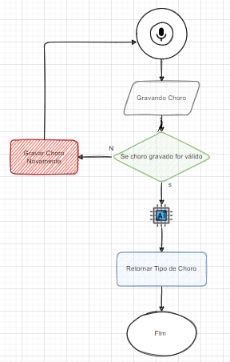

<h1 align="center">
    
</h1>
<h4 align="center"> 
	🚧 🚀 Em construção... 🚧
</h4>

  
  
  
  
  

# 👶 WhyCry

É um projeto em parceria com a Plusoft e a CPQD | Com o intuito de promover uma conversão entre o ser humano e uma Inteligência Artificial.

##### Projeto
Para que os pais consigam identificar com agilidade o motivo do choro da criança e assim agir com rapidez, estamos desenvolvendo um app mobile capaz de com um simples toque no botão de microfone, captar o áudio do bebê chorando e envia-lo até uma Inteligência Artificial, que ira apresentar o motivo do choro ..... 

# IntegracaoWhyCry
Documentação e parte da integração projeto WhyCry 
### 2TDSF     Integração-WhyCry

### Equipe Bej.GG: 

Enzo Bense Pagliacci     – RM: 87203  
Gabriel Jesus Dantas     – RM: 88737  
Guilherme Beck Lobo      – RM: 87531  
Gustavo Lopes Carlin     – RM: 87339  
Jhoctan de Deus Teixeira – RM: 88206  

# Informações: 

Este programa fala sobre Inteligência artificial (por vezes mencionada pela sigla em português IA ou pela sigla em inglês AI - artificial intelligence). 
A IA é a inteligência similar à humana exibida por mecanismos ou software, além de também ser um campo de estudo acadêmico.

##### Quais são os benefícios do uso da inteligência artificial no nosso dia a dia?

1 - Aumento da automação. 
2 - Redução de custos operacionais. 
3 - Mais comodidade. 
4 - Dá suporte a avaliação de indicadores e tomadas de decisão. 
5 - Otimiza e automatiza processos. 
6 - Potencializa as campanhas de marketing. 
7 - Melhora o atendimento ao cliente. 

# Instruções: 
##### Fluxo de conversacional voz
Esse fluxo define como o audio percorre e a IA retorna o motivo do choro.....
<h1 align="center">
    
</h1>

### Descrição da Integração e Fluxograma em vídeo: https://youtu.be/v6mEJrI_3Xs
